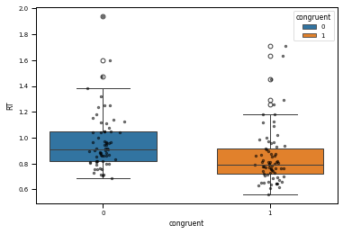
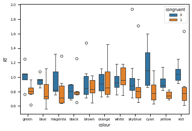

# Modified Stroop Test (MST)
A Modified Stroop Test (MST) programmed using PsychoPy, forked from [stroopy](https://github.com/marsja/stroopy) Github project.
The scope of the project is to make relevant test for [Inverted Spectrum experiment](https://osf.io/ed4sy/), so the stimuli were set as opposite colors. 

## Changes
Version 1.0 changes from [stroopy](https://github.com/marsja/stroopy):
* Stimuli were extended to 6 color-opposite pairs
* Background color was changed to Gray to allow nonchromatic stimuli (Black and White) presentation
* Controlling buttons were changed to optimize one hand use to LEFT and RIGHT ARROWS
* Updated instructions was added
* Russian language was added to instruction and stimuli
* Stimuli placing on the screen was broaden to allow long color words, as in Russian
* Basic Python code for results analysis are provided (stroop_analysis.py)
* Example of the resulted data made in MST are provided at Data\stroop.csv, results of analyses is on figure below
  
[]
[]
[]

Analyzed  144  trials, accuracy is  95.8 %.

Size of Stroop effect is 119.591 +/- 1.243 ms.

t-statistic 3.076, p-value: 0.003

Accuracy for congruent:  98.61%

Accuracy for noncongruent:  93.06 %

## Instructions
- [x] English
- [x] Swedish
- [x] Russian

## Stimuli
- [x] English
- [x] Swedish
- [x] Russian

---------
